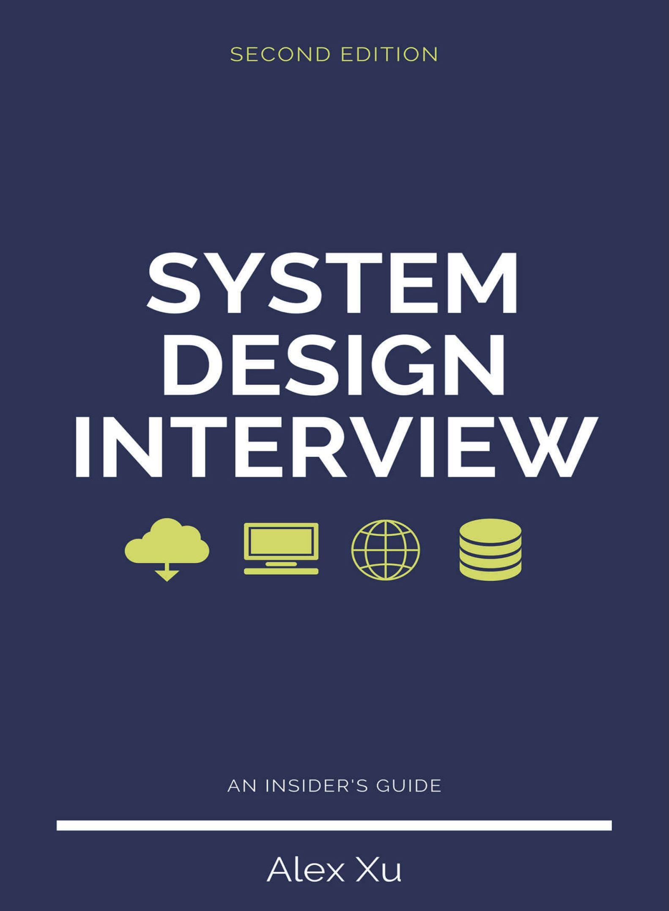

# 系统设计面试：内幕指南

>《System Design Interview: An Insider’s Guide》 - 中文翻译

## 目录

- 前言

- 第1章：从零扩展到百万用户

- 第2章：粗略估算

- 第3章：系统设计面试框架

- 第4章：设计一个限流器

- 第5章：设计一致性哈希

- 第6章：设计一个键值存储

- 第7章：设计一个分布式系统中的唯一 ID 生成器

- 第8章：设计一个URL缩短服务

- 第9章：设计一个网页爬虫

- 第10章：设计一个通知系统

- 第11章：设计一个新闻订阅系统

- 第12章：设计一个聊天系统

- 第13章：设计一个搜索自动补全系统

- 第14章：设计YouTube

- 第15章：设计Google Drive

- 第16章：持续学习

- 后记
